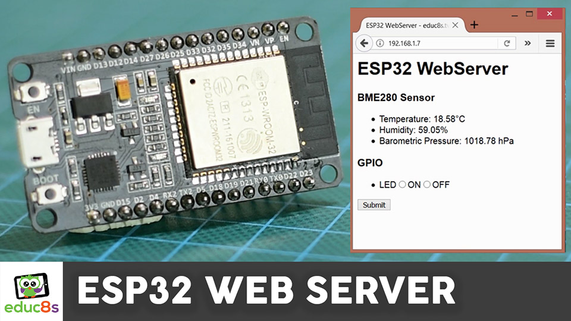

# ESP32 Web Server with BME280 Sensor

An HTTP web server is running on this ESP32 board. If we open a Web Browser and make a request to the IP address of the ESP32, an HTML page will be loaded with the readings we get from the BME280 sensor. The values are updated once every minute. The BME280 sensor can measure the temperature, the humidity, and the barometric pressure and it communicates with the ESP32 using the I2C interface. Check the ESP32 Weather Station project for more information. The HTML page also enables us to control the state of an LED which is connected to the ESP32 board. We can set the state of the LED here and when we press the Submit button the state of the LED changes. How cool is that! In my opinion, this is a very useful functionality that it will enable us to build some very interesting projects in the future! Let's now see how to build this project.

# Video Tutorial

  

🎥 <a href="https://youtu.be/aUSwEkJCIAA">Video Tutorial on YouTube</a>

 
 

| 📺 <a href="https://www.youtube.com/educ8s">YouTube</a>
| 🌠<a href="http://www.educ8s.tv">Website</a> |  

# Parts Needed

🛒 ESP32 ▶ http://educ8s.tv/part/esp32s2

🛒 ESP32

💖 Full disclosure: All of the links above are affiliate links. I get a small percentage of each sale they generate. Thank you for your support!

